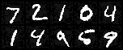
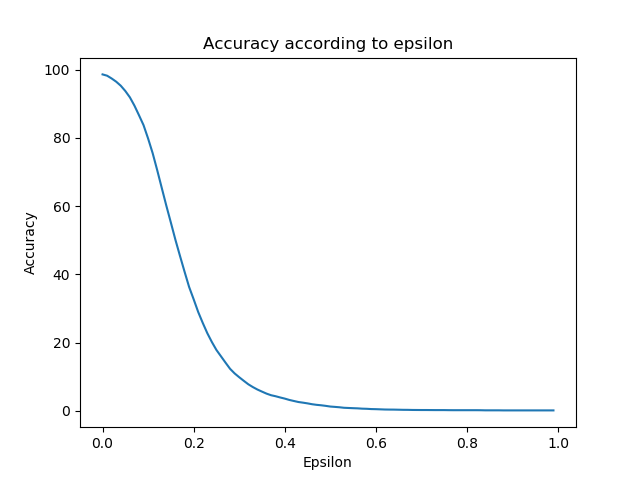

## Description

A pytorch implentation of FGSM attack method in a paper
https://arxiv.org/abs/1412.6572

$x'\quad =\quad x\quad +\quad \varepsilon sign({ \triangledown  }_{ x }J(\theta ,x,y))$


## Usage

I trained simple fully-connected model (28*28 -> 1000 -> 500 -> 10) using MNIST dataset and save checkpoint in modelsave folder.

For checking accuracy with specific epsilon value,

```python3
python3 test.py --batch_size 100 --epsilon 0.2
```


For saving accuracy graph,

```python3
python3 show_graph.py
```


For saving example images with specific epsilon value,

```python3
python3 show_example_images.py --epsilon 0.5
```


## Examples



(Epsilon : 0.5)


## Accracy



